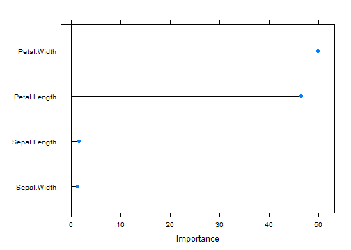

## Data Set

This famous (Fisher's or Anderson's) iris data set gives the measurements in centimeters of the variables sepal length and width and petal length and width, respectively, for 50 flowers from each of 3 species of iris. The species are Iris setosa, versicolor, and virginica.

iris is a data frame with 150 cases (rows) and 5 variables (columns) named Sepal.Length, Sepal.Width, Petal.Length, Petal.Width, and Species.


```
##   Sepal.Length Sepal.Width Petal.Length Petal.Width Species
## 1          5.1         3.5          1.4         0.2  setosa
## 2          4.9         3.0          1.4         0.2  setosa
## 3          4.7         3.2          1.3         0.2  setosa
## 4          4.6         3.1          1.5         0.2  setosa
## 5          5.0         3.6          1.4         0.2  setosa
## 6          5.4         3.9          1.7         0.4  setosa
```


--- .class #id 

### Iris Shiny App
This shiny app predicts species based on user input of Sepal Length, Sepal Width, Petal Length & Sepal Width. App builds model based on 150 observation data collected. 

This App uses random forests machine learning algorithm to classify data selected by user on app. 

Using reactive expressions, Shiny app reuses already built model and quickly predicts species as soon as data is being changed on slider control for input.

Shiny App : http://jigar.shinyapps.io/Iris_App/

---
## EDA: Feature Plot 
 

---
## Model Training
classification using random forest

```r
library(caret)
fit <- train(Species~.,data=iris,method="rf")
```
 


